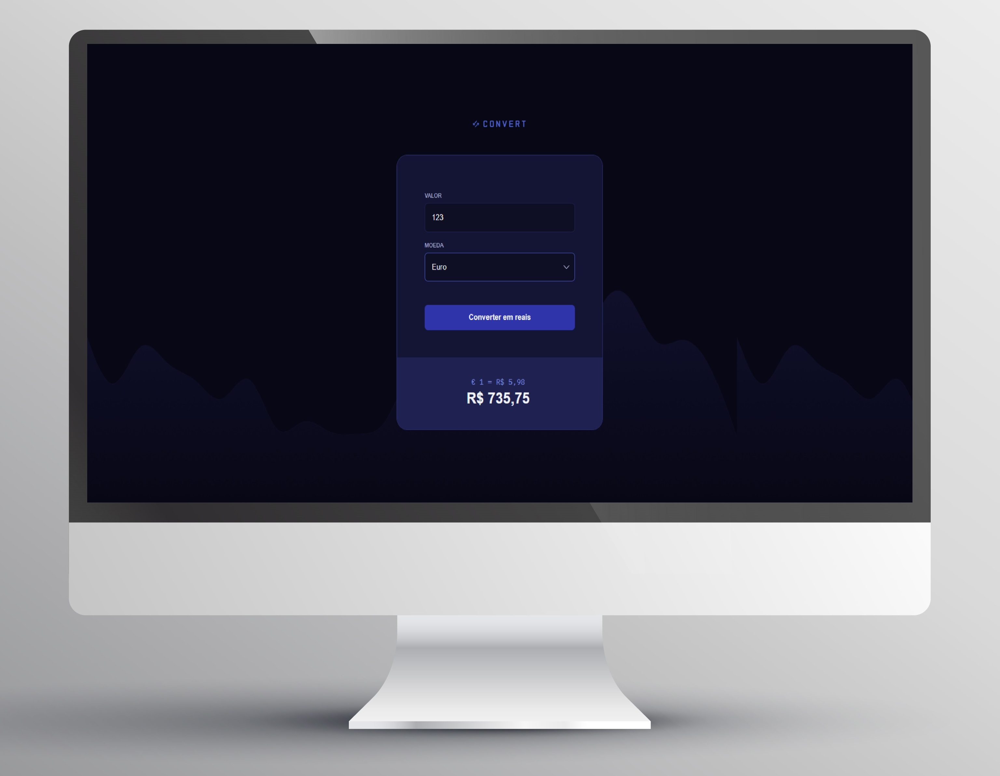

# Convert

Aqui está um projeto que desenvolvi com o objetivo de facilitar a conversão de moedas estrangeiras para o Real, inspirado no design do site [Rocketseat](https://www.rocketseat.com.br) !!

## Sumário

- [Meu Processo](#meu-processo)
  - [Construído com](#construído-com)
  - [O que eu aprendi](#o-que-eu-aprendi)
- [Autor](#autor)

## Meu Processo

### Construído com

- Marcação HTML5 Semântica
- Propriedades Personalizadas CSS
- JavaScript para interatividade

### O que eu aprendi

Neste projeto, aprendi sobre o consumo de APIs e a resolução de Promises. Além disso, consolidei meu entendimento sobre o uso de funções assíncronas, utilizando async/await, visando as boas práticas do JavaScript moderno. Outro tópico que explorei foi a manipulação do DOM, para trazer dinamismo à página.

## Autor

